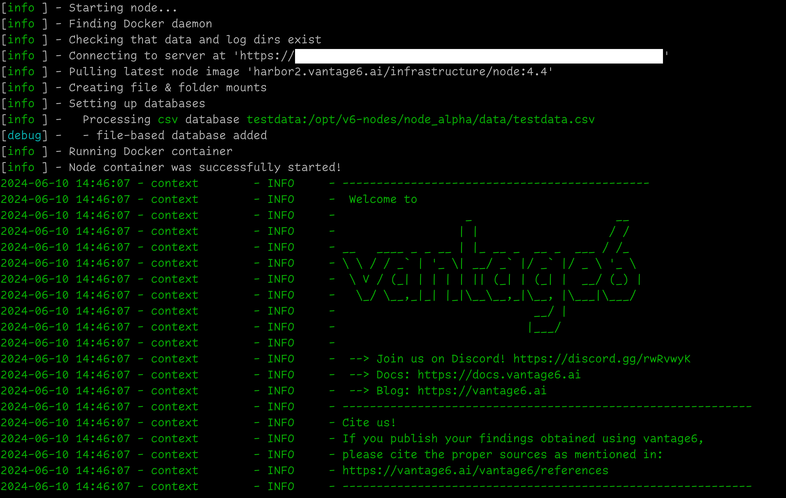
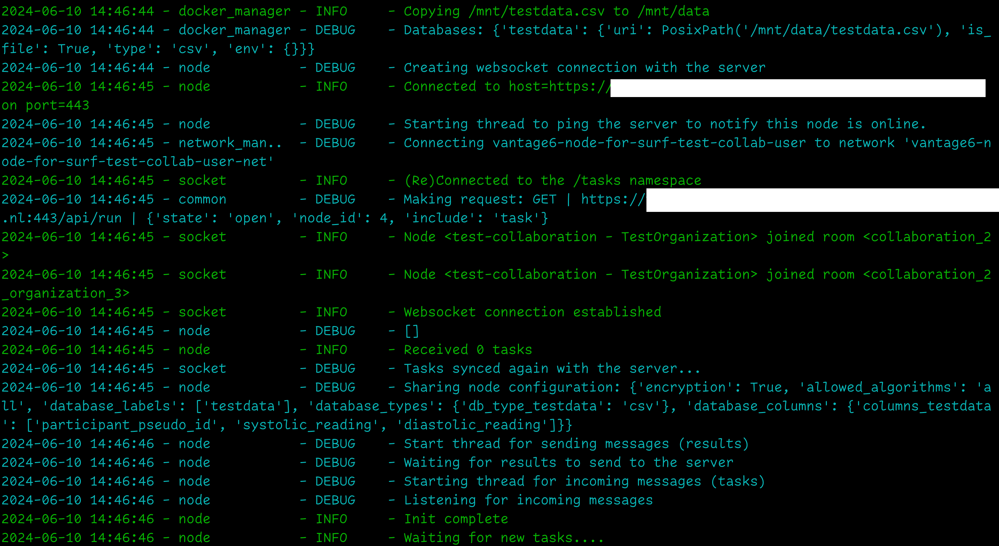
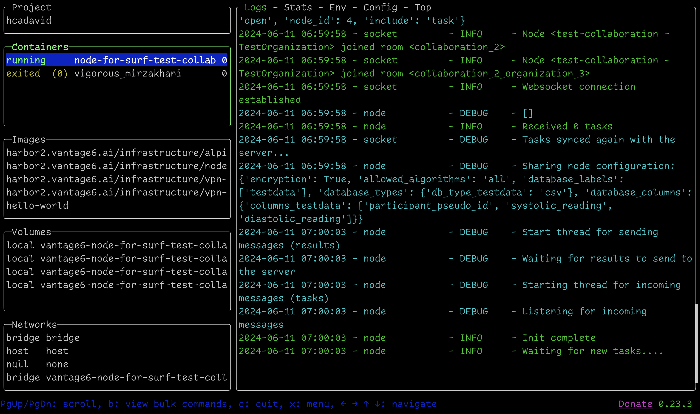

# Setup instructions for a setting up a vantage6 node as a Linux systemd service


Requirements: 

 - A linux user with sudo privileges
 - Information provided by the vantage6 server admin:
	 - 	Server URL
	 -  API key
	 -  User name and password of the vantage6 server's organization admin

# 1. Installing docker

Refer to [official documentation](https://docs.docker.com/engine/install/ubuntu/)


# 2. Creating an user for the service

### Create a user for the service

Create a regular user (no sudo privileges)

```
sudo useradd v6
```

### Create a home directory for the service

Create a folder on /opt/ as the home directory of the service-related user, and ensure that only the 'v6' user can access it:


```
sudo mkdir /opt/v6-nodes
sudo usermod --home /opt/v6-nodes --shell /bin/bash v6
sudo chown -R v6:v6 /opt/v6-nodes
# Set the permissions of the /opt/v6 directory so that only the owner (user 'v6') can read, write, and execute files within it
sudo chmod 700 /opt/v6-nodes
```

### Set user password

Set a strong password for the v6 user:

```
sudo passwd v6
```

### Verify that the user was properly configured

This command should output information about the user v6, including the home directory, which should now be /opt/v6-nodes.

```
id v6
```

### Add the new user to the Docker Group

This is needed as the service will lauch the docker daemon as the 'v6' user. To add the user v6 to the Docker group, use the following command:

```
sudo usermod -aG docker v6
```

Logout and login again as v6 before continuing, so that the user's group rights are reloaded.

### Check that the v6 user can execute docker commands

Hello-world from the v6 user

```
v6@node:~$ docker run hello-world
```

# Creating a node for a collaboration

### Login as the new v6 user

```
su v6
```

### Create a folder for the service software and data

The following steps assume that the service will be called **'node_alpha'**. You can change it to one that suits your setup. These steps also require an API key, the vantage6 server URL, and the credentials of a vantage6 user with organization management privileges.

### Install vantage6 on the service home folder.

Create a folder for the node within the v6's user home folder (opt/v6-nodes)

```
mkdir $HOME/node_alpha
mkdir $HOME/node_alpha/data
```

Get the test dataset included in this repository on the 'data' folder previously created:

```
curl https://raw.githubusercontent.com/MyDigiTwinNL/MyDigiTwin-federeated-learning-node-setup-guidelines/main/dummy-data/testdata.csv?token=GHSAT0AAAAAACPNM3N7V5FWFW5SZVLDWTHQZTHBASA -o $HOME/node_alpha/data/testdata.csv
```

Install vantage6 dependencies. This is tested with vantage6 4.4.1 node/server

```
cd $HOME/node_alpha
python -m venv venv
source venv/bin/activate
pip install vantage6=4.4.1
```

Create a new node using the `v6 node` command. Make sure it is created at a user level:

```
v6 node new --user
```

```
mkdir $HOME/.config
mkdir $HOME/node_alpha
mkdir $HOME/node_alpha/data
```

Enter:

```
(venv) v6@node:~/$ v6 node new --user
? Please enter a configuration-name: node_alpha
? Enter given api-key: ENTER_THE_GIVEN_KEY
? The base-URL of the server: ENTER_THE_GIVEN_URL
? Enter port to which the server listens: 443
? Path of the api: /api
? Task directory path: (*USE THE DEFAULT VALUE) /opt/v6-nodes/.local/share/vantage6/node/node_alpha-config
? Do you want to add a database? No *(IT WILL BE ADDED LATER)
? Which level of logging would you like? DEBUG
? Do you want to connect to a VPN server? No
? Do you want to add limit the algorithms allowed to run on your node? No (*THIS WILL UPDATED LATER)
? Encryption is enabled for this collaboration. Accept? Yes
? Path to private key file: * JUST PRESS ENTER (the key will be added later)
[info ] - New configuration created: /opt/v6-nodes/.config/vantage6/node/node_alpha-config.yaml
[info ] - You can start the node by running v6 node start (*Do not start the node yet!)

```

Edit the generated YAML configuration file, and add an entry to the `databases` section so it includes the csv previously downloaded on `/opt/v6-nodes/data` as the 'testdata' database:

```
api_key: THE_GIVEN_API_KEY
api_path: /api
databases:
- label: testdata
  type: csv
  uri: /opt/v6-nodes/node_alpha/data/testdata.csv
 
...
```

Set the node's encryption key. When running the following command, you will be asked for the organization's manager user name and password:

```
v6 node create-private-key -n node_alpha
```

Expected output:

```

? Username: orgadmin
? Password: ******
[info ] - Generating new private key
[warn ] - Private key written to '/opt/v6-nodes/.local/share/vantage6/InstanceType.NODE/privkey_organization_name.pem'
[warn ] - If you're running multiple nodes, be sure to copy the private key to the appropriate directories!
[info ] - Deriving public key
[info ] - Updating configuration
[info ] - Uploading public key to the server. This will overwrite any previously existing key!
[info ] - [Done]
```

The configuration file (/opt/v6-nodes/.config/vantage6/node/node_alpha-config.yaml) now should have a private key used for data encryption:

```
...
encryption:
  enabled: true
  private_key: /opt/v6-nodes/.local/share/vantage6/InstanceType.NODE/privkey_organization_name.pem
  ...
```

Run the node manually, and check that it doesn't report errors:

```
v6 node start -n node_alpha --attach
```





Exit the attached node's log (Ctrl-C) and shut down the node:

```
v6 node stop -n node_alpha 
```

## Setting up a systemd service for the vantage6 node

**Login again as an user with sudo privileges**

### Creating a Service File

Create a systemd service file that defines how the should behave. On an ubuntu server, it is on the /etc/systemd/system/ folder. In this case we will call the service file 'node_alpha.service'.

```
sudo nano /etc/systemd/system/node_alpha.service
```

For the file content, make sure that as a value for the `--name` flag of ExecStart and ExecStop you are using the configuration name you gave when you executed the `v6 node new` command (`? Please enter a configuration-name: `). Also make sure you use the right folder paths:

```
[Unit]
Description=vantage6 node service
Requires=docker.service
After=docker.service

[Service]
Type=oneshot
RemainAfterExit=yes
User=v6
WorkingDirectory=/opt/v6-nodes/node_alpha
Environment="PATH=/opt/v6-nodes/node_alpha/venv/bin"
ExecStart=/opt/v6-nodes/node_alpha/venv/bin/v6 node start --name node_alpha
ExecStop=/opt/v6-nodes/node_alpha/venv/bin/v6 node stop --name node_alpha

[Install]
WantedBy=multi-user.target
```

## Reloading Systemd
After creating the service file, you need to reload systemd to make it aware of your new service.

```
sudo systemctl daemon-reload
```

## Starting the Service
Now, you can start your service using the following command:

```
sudo systemctl start node_alpha.service
```

## Checking the status of the service

To view the status of the service, you can use journalctl:

```
sudo journalctl -u node_alpha.service
```

## Checking the node status

As the vantage6 node runs within a Docker container, it is important to also check the logs within it. One option is to install and run [lazydocker](https://github.com/jesseduffield/lazydocker), to see which containers are running once the service has started:



Alternatively, you can login to as the v6 user, and use the 'attach' command to check the logs:

```
/opt/v6-nodes/node_alpha/venv/bin/v6 node attach --name node_alpha
```


## Enable the Service

Once you have configured the systemd service, make sure it will start automatically at boot:

```
sudo systemctl enable node_alpha.service
```


# Updating vantage6 node version

TODO

