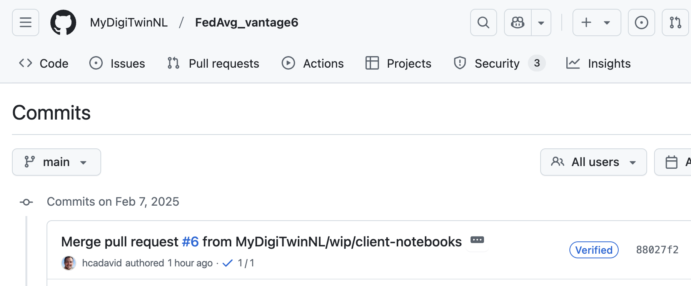

# Reviewing a vantage6 algorithm

This document provides a quick overview of how to review the vantage6 algorithms created for the MyDigiTwin project. It serves as a resource for node administrators during the process of white-listing a new algorithm in the node configuration.

## MDT - vantage6 Algorithms

The vantage6 algorithms are distributed as Docker packages. These containers encapsulate a Python project developed by the algorithm creator, built on top of a series of standard vantage6 libraries.

The MyDigiTwin docker images will be hosted on the [project's GitHub organization registry (ghcr.io)](https://github.com/orgs/MyDigiTwinNL/packages). Consequently, the source code will also be available within the same organization. By convention, the algorithms images that are automatically built through GitHub actions, will have as a Tag either the same version Tag of the Git commit used to build the image, or the hash code of the Git commit. With this, administrators can easily check that they are reviewing the exact version of the container they will eventually whitelist.

In the image below, the image built for the [FedAvg](https://github.com/MyDigiTwinNL/FedAvg_vantage6) algorithm has as a Tag a hashcode that starts with 88027f24:


Which correspond to one of the algorithms source code commits:



## Image structure

Once the corresponding Tag/Commit has been identified, the following base structure can be used to explore the components of the algorithm:

```
Dockerfile
LICENSE
README.md
algorithm_store.json
docs
<algorithm_name>/
    __init__.py    
    central.py
    partial.py
requirements.txt
setup.py
test
```

### Dockerfile 

The following is a standard Dockerfile of a vantage6 algorithm. Here the administrator can check that the based image is the expected one (the one from harbor2.vantage6.ai).

```
# basic python3 image as base
FROM harbor2.vantage6.ai/infrastructure/algorithm-base

ARG PKG_NAME="<algorithm_name>"

# install federated algorithm
COPY . /app
RUN pip install /app

ENV PKG_NAME=${PKG_NAME}

# Tell docker to execute `wrap_algorithm()` when the image is run. This function
# will ensure that the algorithm method is called properly.
CMD python -c "from vantage6.algorithm.tools.wrap import wrap_algorithm; wrap_algorithm()"

```

Likewise, in the **setup.py** file can be checked to ensure that the included dependencies are reliable ones:


```
from os import path
from codecs import open
from setuptools import setup, find_packages

setup(
    name='<algorithm_name>',
    version="1.0.0",
    description='...',
    packages=find_packages(),
    python_requires='>=3.10',
    install_requires=[
        'vantage6-algorithm-tools',
        'pandas',
        'psutil',
        '...'
    ]
)
```

### Algorithm internals

The `__init__` file In the python package folder defines which functions can be requested:

## <algorithm_name>/\_\_init\_\_.py
```
from .central import *
from .partial import *
```

## Module with a 'central' function
```
...

@algorithm_client
def central(
    client: AlgorithmClient, argx, argy, argz
) -> Any:

    """ Central part of the algorithm """
    organizations = client.organization.list()
    org_ids = [organization.get("id") for organization in organizations]

    # Define input parameters for a subtask
    info("Defining input parameters")
    input_ = {
        "method": "partial",
        "kwargs": {
            "argx": argx,
            "argy": argy,
            "argz": argz,
        }
    }

    # create a subtask for all organizations in the collaboration.

    info("Creating subtask for all organizations in the collaboration")
    task = client.task.create(
        input_=input_,
        organizations=org_ids,
        name="Network diagnostics",
        description="Network diagnostics"
    )

    # wait for node to return results of the subtask.
    info("Waiting for results")
    results = client.wait_for_results(task_id=task.get("id"))
    info("Results obtained!")

    # return the final results of the algorithm
    return results
```

## Module with a 'partial' function (accessing data)

```
@data(1)
def partial_risk_prediction(
    df1: pd.DataFrame, argx, argy, argz
) -> Any:

    #Process the database
    m = df1.mean()
    ...

    return {
        "partial_result": ...
    }
```


A more in-depth overview of how a vantage6 algorithm is developed is available on the [vantage6 documentation](https://docs.vantage6.ai/en/main/algorithms/index.html).

